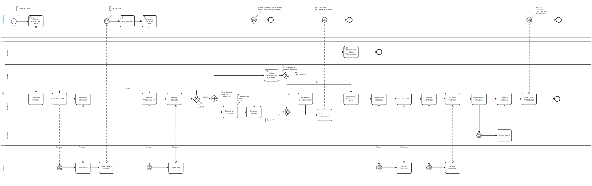
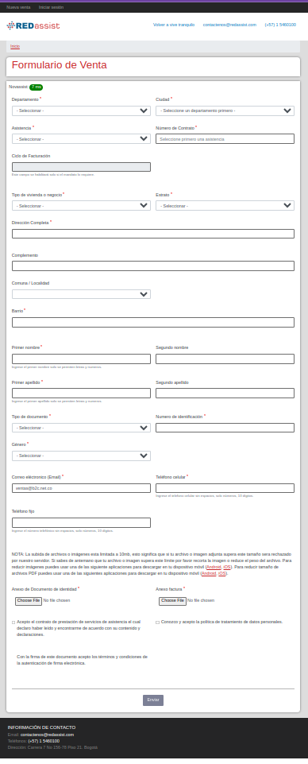
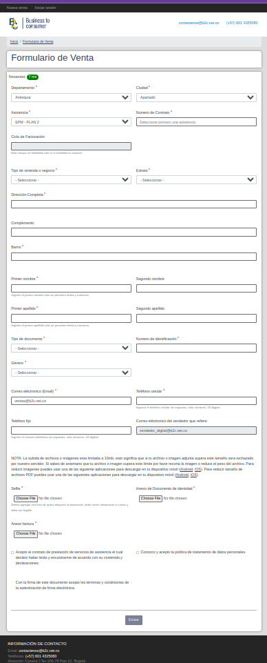

# Micro Insurance - Case Study

[933 Asistencia - B2C](https://933asistencia.com/) and [RedAssist](https://vivetranquilo.co/) are two different companies use a same code environment to sale micro-insurance for home issues.

The sale process was discussed and designed in colaboration with legal, product, sales and tech teams. I lead this process from the technical side and modeling the required process using BPMN.

[Download](./.project/assets/digital-signature-diagram.bpmn) | [Open it at BMPN.io](https://bpmn.io/)

The process starts with a ensurance request, where the requester must to fill several fields, even including attaching support files in order to fulfil legal quality standards from the company and the govern, as an effort to avoid claims from problematic clients.

| B2C | RedAssist |
| --- | --------- |
|  |  |
| [Access form](https://ventas.b2c.net.co/sale/b2c/steps/427) | [Access form](https://ventas.b2c.net.co/virtual/redassist/miventa) |

Each request is considered an e-commerce sale, so, we create a client and its insurance as part of a commerce process.

